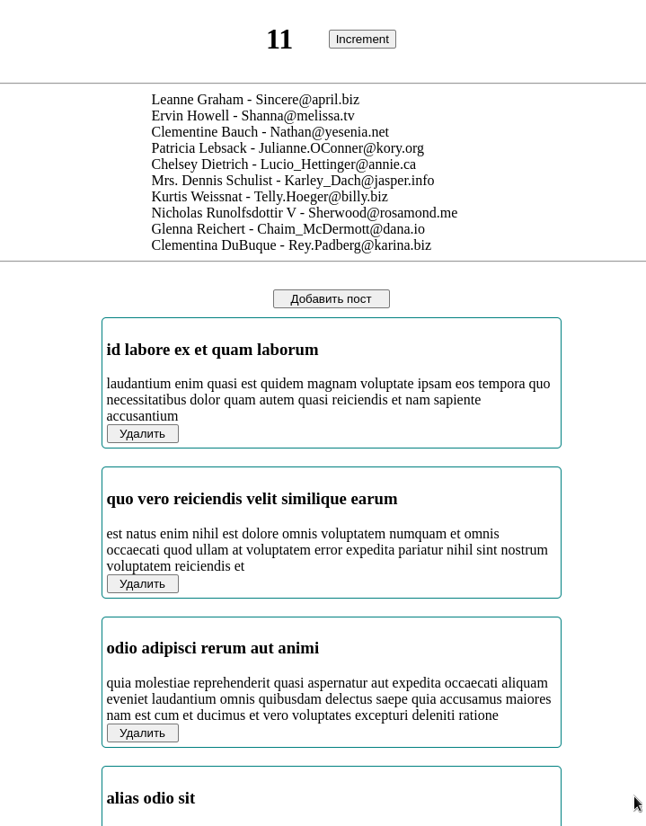

# Readme

---

```bash
npm i && npm start

npm i -g json-server
json-server --watch db.json --port 5000
```
<a href="http://localhost:3000" target="_blank">localhost:3000</a>

---

### Продвинутый Redux
Redux Toolkit, RTK query, TypeScript


